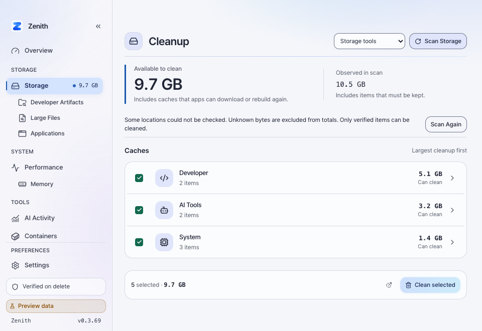
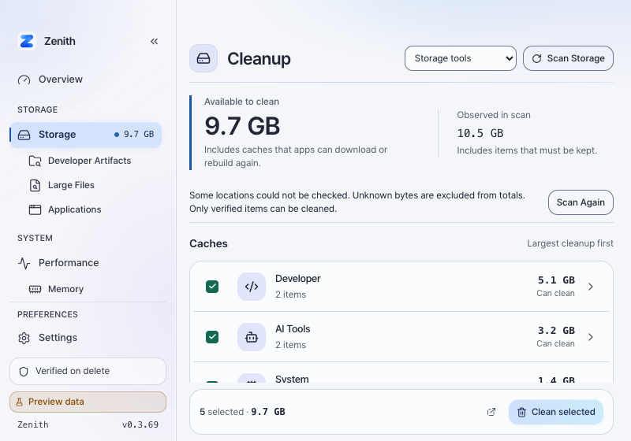
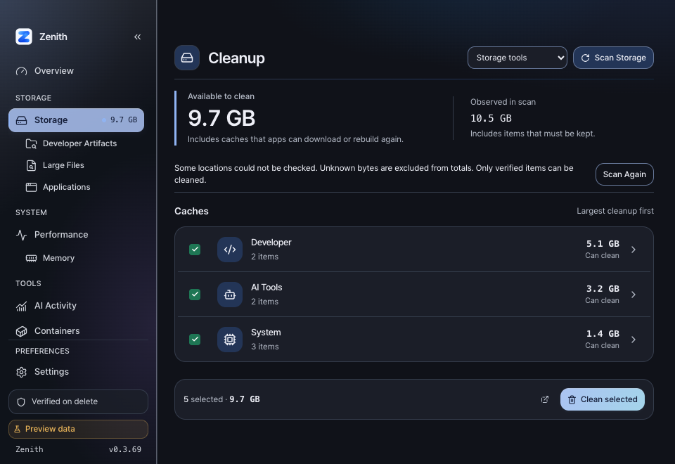
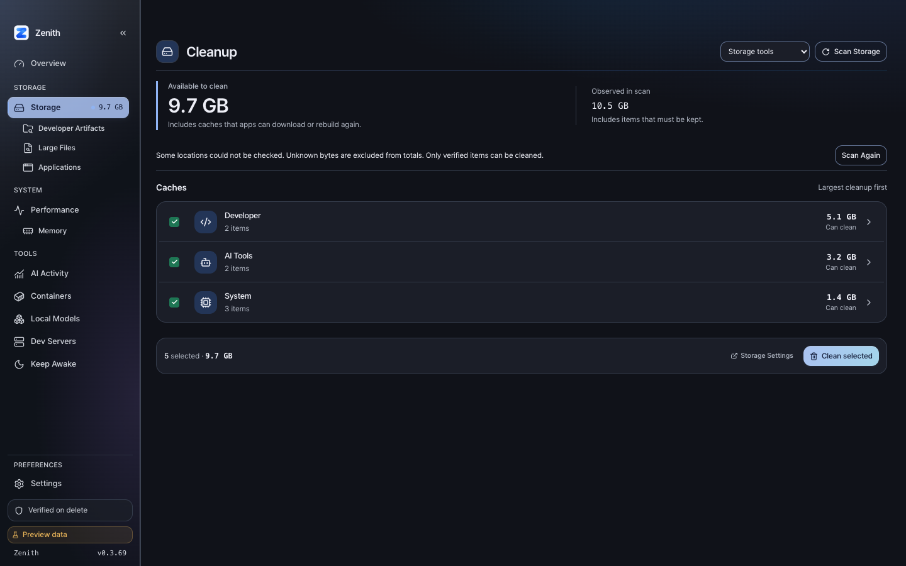
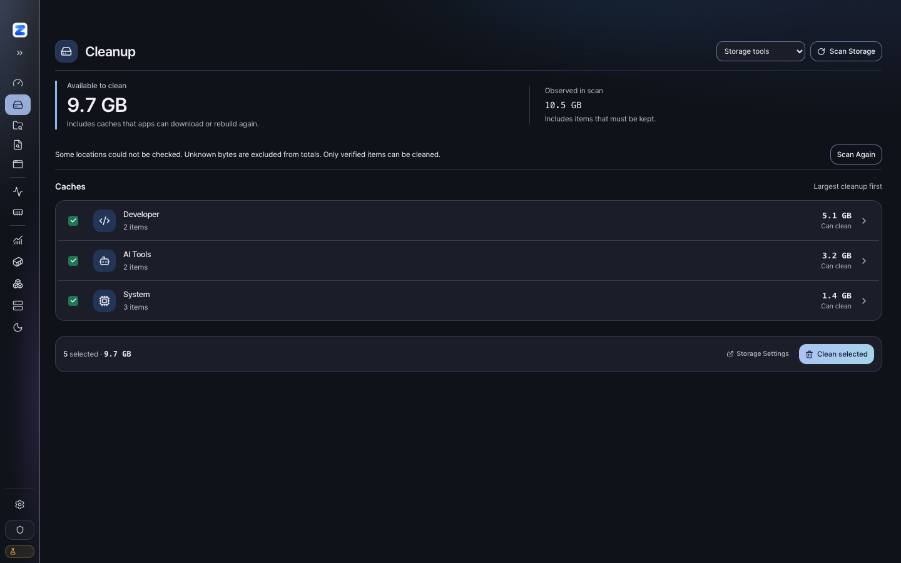
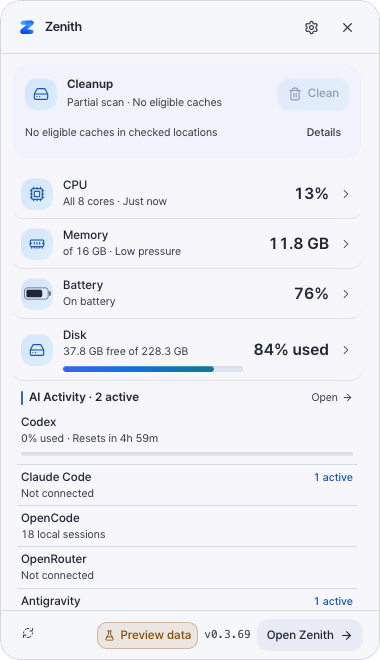
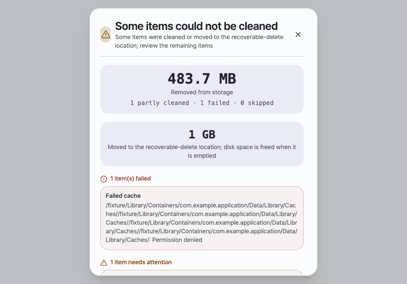
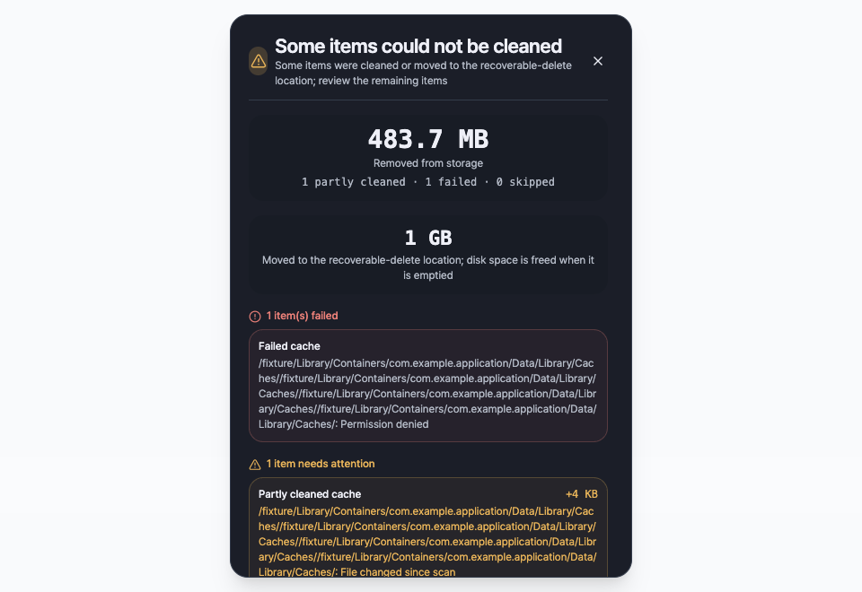

# Cleanup execution and navigation, 0.3.69

Issues #326 and #327 share one PR. Version: 0.3.68 → 0.3.69.

## Execution fixes

The sandbox-cache scanner creates units for ordinary files as well as
directories. Trash execution previously called `read_dir` on both. The content
strategy now validates the unit and moves a regular file directly; directory
units retain their entry-by-entry walk. The permanent-delete path already
handled ordinary files.

Stale-content scans exclude structured state from their reclaim estimate.
Execution now counts deliberately preserved structured entries as policy skips,
instead of reporting an IO failure. Whole-directory and non-stale cleanup keep
their existing refusal rules. A successful target can state how many entries
were kept or already absent. Genuine errors still produce partial/failed results.

The regression fixture exercises scanner → planner → executor with a standalone
old `.txt` file, a directory containing an old cache file, a recent file, and
old DB/WAL/SHM files. Each mode estimates 16,384 allocated bytes:

| Mode | Actually unlinked | Moved into fixture Trash | Failed / partial |
| --- | ---: | ---: | --- |
| Safe | 16,384 B | 0 B | 0 / 0 |
| Rebuild | 0 B | 16,384 B | 0 / 0 |

The fixture Trash adapter performs filesystem renames into a temporary
directory. Both modes preserve the parent, recent file, and structured state.
This is real fixture mutation, not a system Trash integration test or a
measurement of live disk-free delta. No real user cache was removed.

## Mole comparison

Inspected installed Homebrew Mole 1.55.0 under
`/opt/homebrew/Cellar/mole/1.55.0/libexec`. Its `lib/clean/dev.sh` implements
Clang cache cleanup through `clean_clang_module_cache` and
`clean_guarded_dev_cache_root`; `lib/core/app_protection.sh` lists Xcode build
processes. It checks process state and cache-root identity, without an age
cutoff for this specific regenerable cache. Zenith previously encountered this
root only through its broad seven-day namespace policy.

Zenith now has `dev.clang.module_cache`, rooted only at the platform-resolved
`${DARWIN_USER_CACHE}/clang`. It retains the cache root and guards Clang, clangd,
Swift, SourceKit, Xcode, and Xcode build/test services. Existing scan, plan,
execution, symlink, identity, and structured-state checks remain active. The
broad namespace signature excludes `clang` so a conflicting age rule does not
shadow this exact rule. Rebuild cleanup uses Trash and states the rebuild cost.

Mole's Homebrew preview must not be treated as proof that its entire cache root
will be deleted. `lib/clean/dev.sh` limits blanket cleanup to `downloads` and
explicitly preserves `api`, `bootsnap`, and lock files; `lib/clean/brew.sh`
delegates other work to Homebrew. The observed 38,592,512 B in this comparison
were metadata caches, which Zenith correctly reports as advisory. Removing
those bytes just to match a preview total would not match Mole's implementation.

Initial read-only comparison on September 28, 2026, macOS 27.0 (26A428):

| Metric | Mole 1.55.0 | Zenith before the Clang rule |
| --- | --- | --- |
| Mode | `mo clean --dry-run`, no sudo | Full catalog, intensive, native providers, no cleanup |
| Wall time | 50.30 s | 34.28 s (scan metric 33.577 s) |
| Reported amount | 235.7 MB potential, 134 entries | 55,836,672 B cleanable; 29,724,672 B selected |
| Observed amount | Preview is not a full inventory | 2,121,076,736 B |
| Access coverage | System cleanup skipped | Partial: 452 Full Disk Access, 20 permission, 6 IO gaps |

These first runs overlapped builds and each other, so their timings are only
diagnostic and do not establish a speed advantage. Mole's display uses its own
size formatting; Zenith's values here are exact bytes. The private ledgers stay
outside the repository. `scripts/cleanup_coverage_audit.py` found 11 exact path
matches, 82 Zenith-ancestor matches, 4 descendant matches, and 37 reference-only
rows. Three nested preview rows mean displayed amounts cannot simply be summed.
An ancestor match is coverage evidence, not equal deletion authority.

The largest actionable difference was 93,581,312 B of Clang ModuleCache,
previously `recent`. Browser caches were reviewable, and Homebrew metadata was
advisory. Smaller reference-only rows include generated search dictionaries and
other application cache entries; this PR does not claim full cleanup parity.

### Final sequential observation

After all builds and tests finished, Mole ran first and Zenith second, with no
cleanup between them. Both used the same modes as above. Zenith's measurement
started at Unix timestamp 1790551865. This is one warm, changing-machine sample,
not a throughput benchmark or controlled before/after performance experiment.

| Metric | Mole 1.55.0 | Zenith 0.3.69 |
| --- | --- | --- |
| Wall time | 28.15 s | 17.96 s (scan metric 17.408 s) |
| Preview / cleanable | Displayed 342.3 MB potential, 136 rows | 254,611,456 B cleanable |
| Automatic selection | Not the same selection model | 123,301,888 B |
| Clang ModuleCache | Listed | 93,581,312 B automatic and cleanable |
| Actual user-cache deletion | Not run | Not run |

Clang's measured footprint stayed exactly 93,581,312 B from the initial to the
final observation; its new eligibility is the isolated coverage gain. The
increase in whole-machine totals is not all attributable to this change:
compilation populated 104,169,472 B of Cargo cache, and other caches changed.

The final audit has 13 exact matches, 81 ancestor matches, four descendant
matches, and 38 reference-only rows. It still finds three nested preview rows.
Homebrew metadata accounts for 38,592,512 B that Mole's blanket-download code
does not delete. Smaller unmatched generated caches remain; full parity and
real-user deletion throughput are unproven. No preview byte total is reported
as actual freed disk space. Raw paths remain private; the aggregate audit is
[available here](cleanup-0.3.69/comparison-final.json).

## Interface

- Unknown prune amounts say `Not estimated`; detail rows name the tool and
  distinguish store size from reclaim size. Mixed selections count actions
  without an estimate.
- A current Quick Panel scan keeps Clean visible when disabled, with a visible
  backend-derived explanation and Details. Eligible partial scans still clean.
- Overview, Storage, System, and Tools form stable task groups. Direct storage
  workflows and Memory are indented beneath their owner. Saved visibility and
  within-group order persist; Settings reorders within those same groups.
- Results distinguish removed bytes from Trash movement. Long paths wrap, one
  dialog scrolls, and initial focus no longer jumps to the bottom. The close
  control stays reachable.

## Visual evidence

Browser previews and synthetic result fixtures, reduced motion enabled. These
are layout evidence, not native glass verification. The protected material was
not changed. Preview mutation remains disabled.

## Local verification

- `cargo test`: 1,152 passed, four existing ignored tests.
- `cargo check`, all-target Clippy with warnings denied, and formatting: passed.
- `just check-architecture`: both crate boundaries passed.
- `pnpm check`: zero errors or warnings.
- `pnpm test -- --run`: 411 tests in 42 files passed.
- `pnpm build` and `just build-fast`: passed after the final code/catalog changes.
- `just check-version`: all manifests synchronized at 0.3.69.
- App bundle plist version: 0.3.69. Packaged `icon.icns` SHA-256 matches source.
- Browser layout: 800×560, 960×660, 1440×900; light/dark, reduced motion,
  collapsed sidebar, long result paths without horizontal dialog overflow,
  and Escape returning focus from Quick Cleanup Details to its button.

Windows execution and actual native glass composition are not manually tested.
The built bundle is not installed over the user's running app. CI status is
reported on the PR separately from local checks.

### Windows CI fixture correction

The first Windows CI run failed the new Clang catalog test: it combined a
real Windows temporary directory with a simulated POSIX path flavor, so the
scanner discovered zero units. The fixture now uses the runner's path flavor
and explicitly asserts that the catalog placeholder resolves to its real
temporary cache directory. The macOS-only catalog declaration is also asserted.
The same scan assertions remain enabled on every runner; no test is skipped and
no production cleanup policy changes. This follow-up retains version 0.3.69.
