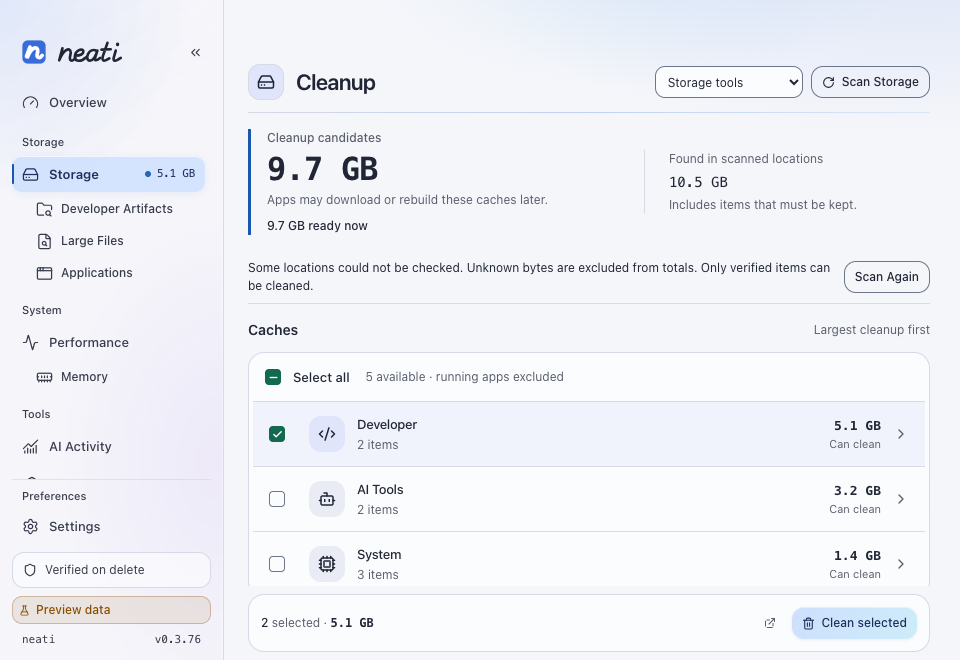
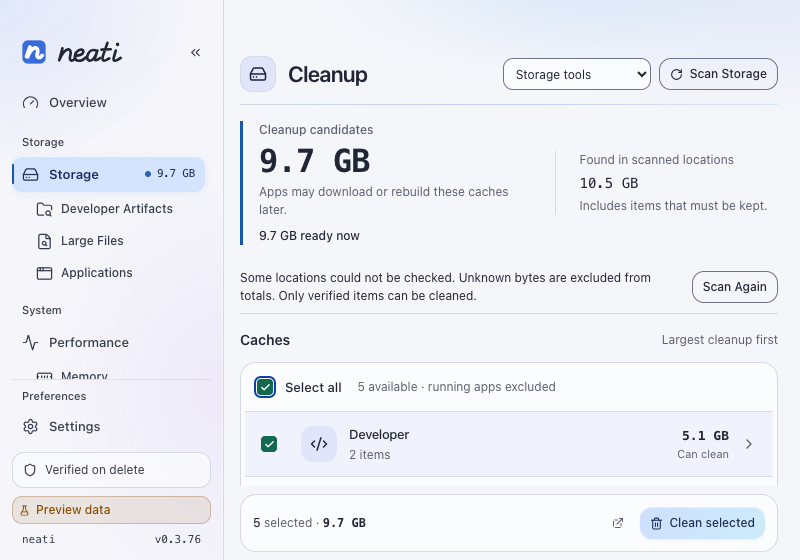
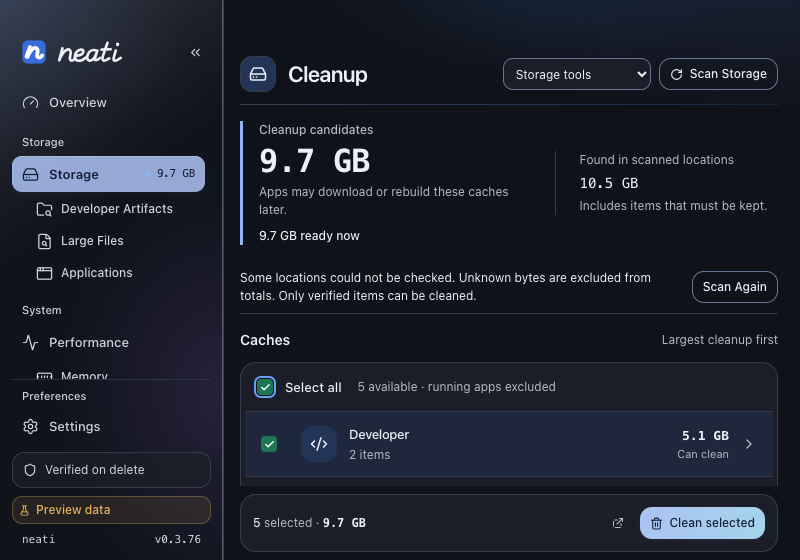
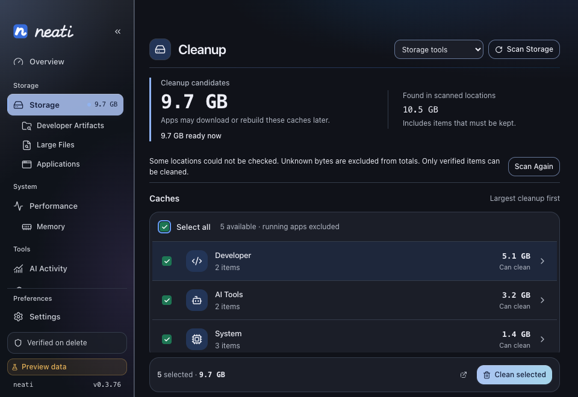
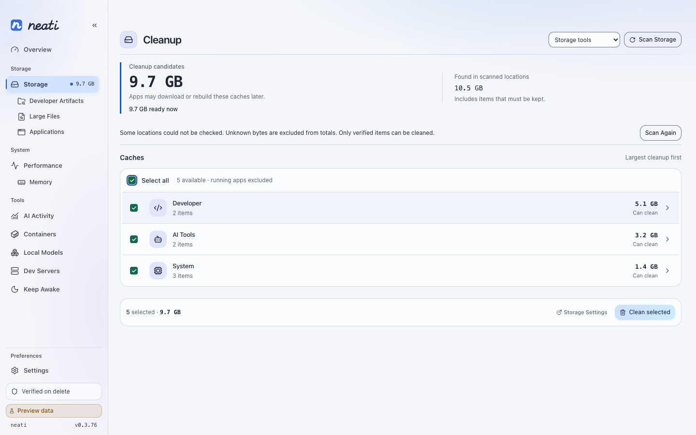
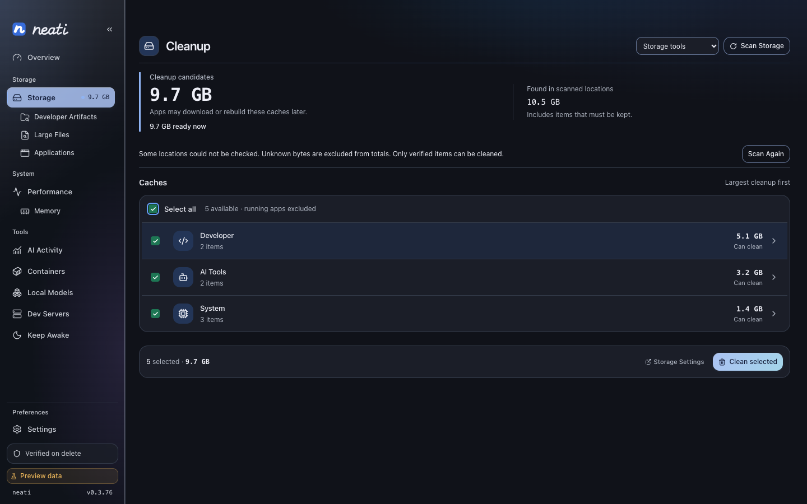

# Cleanup selection and coverage — #345

Version: **0.3.75 → 0.3.76**. Date: September 28, 2026.
Host: macOS 27.0 (26A428), Apple Silicon. No user cache deletion, Trash emptying,
installation, release or native-material change was performed.

## What changed

Storage now offers one labeled Select all checkbox, with empty, mixed and fully
selected states. Its visible label is part of the hit target; Space toggles it.
Bulk selection uses backend eligibility and excludes running-owner facts, advisory
and protected items. Owner actions still require their backend confirmation.
Category bulk selection uses the same predicate. Stale scans cannot change the
executable selection. The summary explains ready-now, close-app-first and
review-required amounts separately; it no longer calls the whole estimate
immediately available.

The UI/UX skill's bulk-action, keyboard-focus and contextual-feedback guidance
informed this control. Existing tokens, system typography and native glass remain.

Two new macOS catalog entries cover Chrome and Brave GPU caches beneath each
profile and the browser root. These were outside the existing HTTP/code cache
rules and the single-level Application Support selector. Each browser has its
own executable/helper guards. Only GPUCache, DawnCache, DawnGraphiteCache,
DawnWebGPUCache, ShaderCache, GrShaderCache and GraphiteDawnCache units are named.
The generic structured-state policy remains ProtectAll. These Rebuild units move
to Trash; movement does **not** claim immediate disk-space recovery.

The profile selector is one directory component (`*`), consistent with the
existing browser cache catalog, not recursive discovery or profile-name
validation. Only the listed cache basenames at that depth are eligible; deeper
extension/cache lookalikes stay untouched. The selector grammar deliberately
does not support partial wildcards, and this change does not broaden that grammar.

Primary owner evidence:

- [Chromium browser cache directories](https://github.com/chromium/chromium/blob/main/chrome/browser/chrome_content_browser_client.cc): GetShaderDiskCacheDirectory, GetGrShaderDiskCacheDirectory and GetGraphiteDawnDiskCacheDirectory bind the root-level locations.
- [Chromium GPU disk-cache factory](https://github.com/chromium/chromium/blob/main/content/browser/gpu/gpu_disk_cache_factory.cc) binds the compositor, Skia and Dawn caches to those owner paths.
- [Chromium GPU disk-cache implementation](https://github.com/chromium/chromium/blob/main/gpu/ipc/host/gpu_disk_cache.cc) identifies the GL, Dawn WebGPU and Dawn Graphite cache types.

No reference implementation was copied. Local RC-01 1.55.0 behavioral inspection
used `lib/clean/user.sh` (browser profiles, process guards, broad user caches) and
`lib/clean/dev.sh` (npm/pnpm/Python/Go/Gradle and download stores). Their SHA-256:

```text
user.sh ff5ae4f2b2acf6309078cb321c383ed4c40accf34265a71670d29f9a71c39f44
dev.sh  15de41d8fe6a69cb95c108b0e8a6d42b401e8a91b44059e8bf8e59f209c5e62d
```

## Read-only comparison, not a deletion benchmark

RC-01's dry-run reported **1.16 GB potential / 495 rows**. Its row display sum was
1,154,996,000 B; six nested rows represented 196,173,000 B already under other
listed paths. The top-level display sum was 958,823,000 B. All values are rounded
decimal preview labels, not verified removals or disk-free deltas.

Both neati observations used the full embedded catalog and native providers in
the read-only `scan_machine` example. Private path ledgers remain outside Git.
The same reference preview is bound by hash in the two aggregate reports:

| Relationship to reference rows | Before | After |
| --- | ---: | ---: |
| Exact path | 17 | 16 |
| Under a neati unit | 192 | 351 |
| Contains neati units | 4 | 4 |
| No matching neati observation | 282 | 124 |

Files changed while the machine was in use; builds also ran between observations.
The one lost exact match and changing totals are not attributed to this patch.
Ancestor matching proves discovery coverage, **not equivalent deletion policy**.
See [before](comparison-before.json) and [after](comparison-after.json).

The isolated new rule populations in the after scan were:

| New rule | Units | Observed / candidate bytes | Automatically selected |
| --- | ---: | ---: | ---: |
| Chrome GPU/shader caches | 20 | 36,159,488 | 0 (running owner) |
| Brave GPU/shader caches | 7 | 32,460,800 | 32,460,800 |

The after scan reported 3,691,978,752 B observed, 265,953,280 B candidate bytes,
and 33,652,736 B automatic selection. That is not a controlled performance result
or a promise that the installed app sees the same directories. This host process
reported five permission and six IO gaps; the user's installed-app screenshot
reported 456 unreadable locations. These are different process identities;
equivalent TCC grants and scan settings were not established.

## Remaining differences, deliberately not hidden

- Running Chrome: HTTP/code and offline/component stores are already discovered;
  the planner still requires an idle owner. A preview total is not authorization.
- npm: neati uses owner verification/garbage collection, not a force reset.
  pnpm: its 160,395,264 B store footprint is not the unknown prune yield.
- Cargo: downloaded archives require review; extracted sources and git state
  remain owner-managed. A compiling Cargo process can change eligibility.
- Gradle: 230,195,200 B observed is mostly versioned/dependency state; the local
  build-cache subtree measured only 147,456 B. The whole store is not disposable
  merely because the reference has a narrower build-cache stage.
- Python: approximately 4.4 MB of Apple-managed generated bytecode remains a
  candidate for a typed bytecode-only contract, not blanket Apple-cache deletion.
- The reference-only population also includes Apple search/media/map service
  state, diagnostic/crash records, updater files, shell dumps and empty paths.
  These require separate ownership proof. Project artifacts remain a scoped
  workspace workflow, not automatic whole-home deletion.
- Browser cookies, sessions, passwords, model downloads, extensions and offline
  CacheStorage are not folded into shader-cache cleanup. Offline stores retain
  their existing dedicated confirmed provider.

Full parity and live deletion throughput remain **unproven**. The change closes
an evidenced omission rather than relaxing all guards to match a headline.

## Verification

Temporary browser fixtures cover multiple profiles/root caches, measured Trash
movement, protected/offline/lookalike siblings, every declared active helper,
unknown process state, owner startup between plan and execution, credentials
inserted after planning, replaced targets and refused links. No native Trash
backend is used by these tests. Existing GPU tests also cover databases, WAL,
locks, settings and symlinked profiles.

Frontend regression tests cover mixed selection, cross-category selection,
running/protected exclusion, clearing, invalidation, byte-population explanation,
visible label and mixed glyph. Browser preview exercised select → clear →
category-only mixed → Space-to-select-all; Clean disabled at zero selection.

Visual evidence uses deterministic preview data, reduced motion, 800×560,
960×660 and 1440×900 in light/dark. The footer remains visible and the page
scrolls at compact height. These are not native glass screenshots.








Final local checks passed:

- `cargo check` and `cargo test`: 1,174 passed, five existing ignored tests.
- `cargo fmt --all --check`, `cargo clippy --workspace --all-targets -- -D warnings`
  and `just check-architecture`.
- `pnpm check`: zero errors and warnings; `pnpm test -- --run`: 434 passed.
- Python cleanup audit tests: 12 passed.
- `pnpm build` and `just build-fast`: current frontend embedded in the debug bundle.
- `just check-version`: all manifests and workspace lock entries agree on 0.3.76.
- The debug bundle's `CFBundleShortVersionString` is 0.3.76. Its `icon.icns`
  matches the source icon's SHA-256:
  `6762519752de4ffc84865d6edc7a80462f3d1edebf4d7c2d94cd9ffa1c460dc9`.

The bundle was built, not installed or launched. The running app is unchanged.
Windows runtime behavior is left to CI; it is not claimed locally verified.
