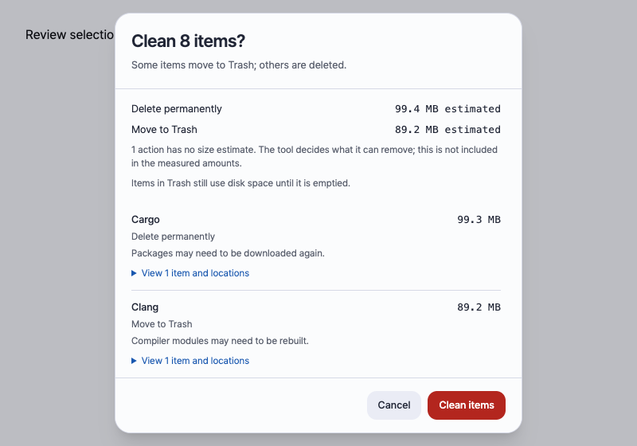
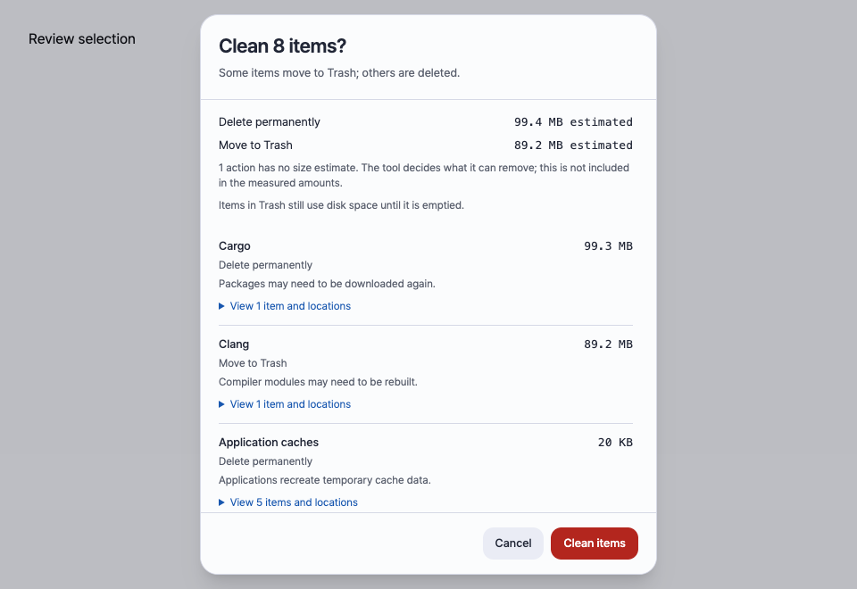
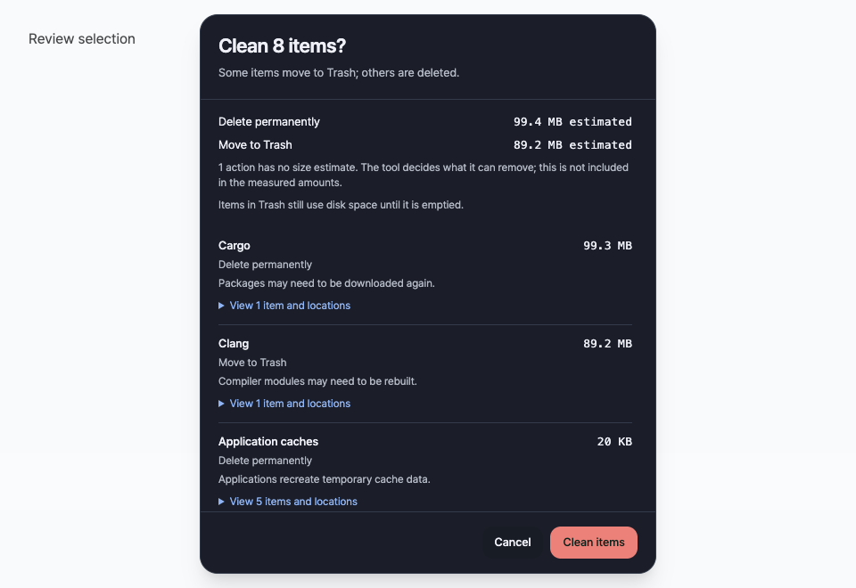
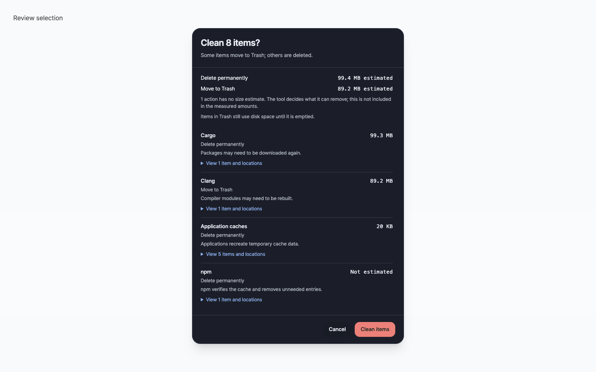
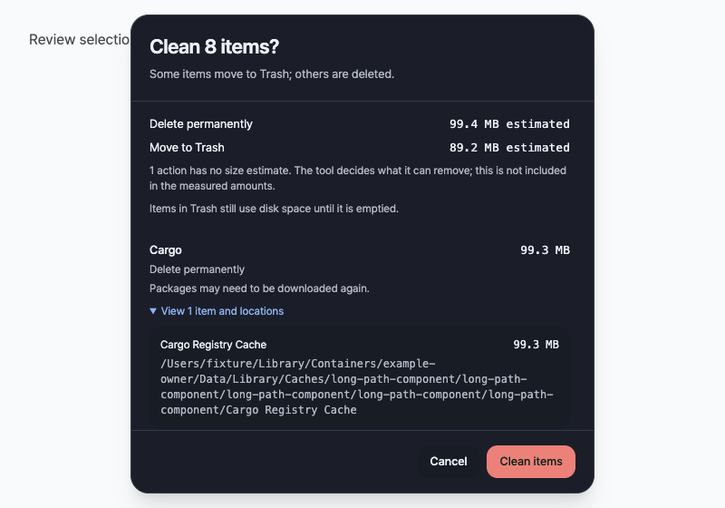

# Cleanup coverage and review clarity — issue #329

## Scope and evidence levels

This is an independent behavioral comparison, not an import of another
implementation. The installed reference cleaner is called **RC-01** here at the
user's request. Source inspection establishes what a cleanup stage requests;
it does not prove its guards allow removal on this machine. No user cache or
system Trash was mutated in this investigation.

- **Source review:** local RC-01 1.55.0 and Neati develop `f179ee3`.
- **Historical machine evidence:** September 28, 2026, macOS 27.0 (26A428),
  Neati 0.3.69; the private preview/scan inputs from #328 were re-analyzed.
- **Fixture verification:** Neati's existing owner-provider, artifact and
safety tests plus new analysis/presentation tests. Mock provider tests do not
establish that every language's installed CLI was exercised.
- **Not executed:** a controlled five-repetition cross-tool deletion benchmark,
  Windows runtime UI QA, live-user deletion and native glass visual QA.

Reference source fingerprints (local files, no source copied into the repo):

| Source | SHA-256 |
| --- | --- |
| `lib/clean/dev.sh` | `15de41d8fe6a69cb95c108b0e8a6d42b401e8a91b44059e8bf8e59f209c5e62d` |
| `lib/clean/user.sh` | `ff5ae4f2b2acf6309078cb321c383ed4c40accf34265a71670d29f9a71c39f44` |

Function/line references below are locators into those snapshots, not excerpts.
Final mutation also depends on the reference cleaner's shared guards. Library
or package-manager behavior on other versions remains unverified.

## Broad ecosystem comparison

Neati global cache policy lives in [developer.toml](../../signatures/developer.toml)
and [typed provider definitions](../../src-tauri/src/cache_providers/catalog).
Project artifacts are a **separate, explicit workspace workflow** in
[rules.rs](../../src-tauri/src/developer_artifacts/rules.rs) and
[recognition](../../src-tauri/src/developer_artifacts/mod.rs). A missing global
signature must not be described as absence of all support for that language.

| Ecosystem | RC-01 source-stage behavior | Neati behavior / actionable difference |
| --- | --- | --- |
| JavaScript / npm | `dev.sh:430`: owner cache reset plus residual cache directories | `javascript.rs`: `cache verify`, not full reset. **Policy difference**, not missing discovery. Never substitute `--force` merely to match bytes. |
| JavaScript / pnpm | `dev.sh:359`: discover installed binaries/store generations; owner `store prune` | Same owner command; compare generation enumeration, deduplication and busy-owner handling. Observed store size is not a prune estimate. |
| JavaScript / Bun | `dev.sh:480`: owner cache removal, with filesystem fallback | `dev.bun.cache` advisory. Candidate for a narrow owner adapter, explicitly **without** filesystem fallback. |
| JavaScript / Corepack | `dev.sh:48`: owner cache operation or filesystem fallback | No dedicated global adapter. Inspect runtime downloads vs disposable metadata before proposing one. |
| TypeScript / frontend tools | `dev.sh:1326`: named global TypeScript, Electron, node-gyp and build-tool cache paths | Project `node_modules` recognition exists; this does not cover all global tool caches. Per-tool discovery investigation needed; no home-wide glob. |
| Python / pip | `dev.sh:768`: discovered pip cache and owner purge | `python.rs`: fixed owner purge with validated executable/cache root. Source-level alignment; no live purge run. |
| Python / uv | `dev.sh:70`: owner prune, otherwise filesystem fallback | Owner prune with bounded lock wait; failed owner operation does not fall back. Preserve that distinction. |
| Python / Poetry, Ruff, MyPy, pyenv | `dev.sh:768`: selected artifact/cache paths, Poetry virtualenvs excluded | No dedicated global signatures; workspace virtualenv workflow is distinct. Poetry artifacts/cache are stronger narrow candidates than deleting the Poetry root. |
| Python / Conda | `dev.sh:252`: owner index-cache, tarball and log cleanup; absent tool preserves stores | No dedicated adapter. Potential owner-operation investigation; expanded packages and environments stay outside scope. |
| Python / PyInstaller | `dev.sh:703`: guarded binary-cache units | No dedicated signature; executable-shaped cache content needs an owner contract, not a generic executable-protection exception. |
| Rust / Cargo | `dev.sh:1193`: guarded downloaded archive cleanup, preserve sources/git dependency stores | Owner archive adapter exists; sources/git advisory. Confirmation and accounting, not basic archive coverage, explain part of the difference. |
| Rust / rustup | `dev.sh:1214`: downloads cache; installed toolchains only reviewed | `dev.rustup.downloads` advisory. Investigate partial/in-progress download ownership before expansion. Project `target` supported separately. |
| Go | `dev.sh:1004`: resolved build/module roots; owner `clean -cache` / `-modcache`, differing process gates | `go.rs`: same fixed operations, local-toolchain-only, active Go guard. Recheck gopls/module-lock behavior; do not infer concurrent safety from build-cache behavior. |
| Java / Kotlin / Gradle | `dev.sh:2855`: only build-cache children plus daemon/worker/notification targets, process guarded | Global `.gradle/caches` advisory; workspace `build`/`.gradle` supported. **230 MB whole-store observation is not 230 MB of missed reclaim.** Measure exact build-cache children first. |
| Java / Maven, Scala / sbt-Ivy, Clojure | `dev.sh:2855`: dependency stores/compiler/launcher state intentionally preserved | Maven global repository advisory; marker-bound project `target` rules for Maven/sbt/Clojure. Preserve global stores; no blanket language-support gap. |
| .NET / NuGet | `dev.sh:3880`: global packages explicitly kept | `nuget.rs`: separate HTTP/temp/plugins/global-packages owner operations with process guards. Neati's explicit global-packages operation is **broader**, not narrower; it is never a generic directory deletion. |
| PHP / Composer | `dev.sh:3880`: legacy/macOS cache paths through shared cleanup | `php.rs`: owner discovery/clear with plugins disabled. Workspace vendor recognition separate. Prefer the owner contract over broad path coverage. |
| Ruby / Bundler / RubyGems | `dev.sh:1217`: rbenv downloads, gem specs/archives and Bundler cache | No dedicated global signature; project `vendor/bundle` recognition exists. Investigate archive/spec units, keeping installed gems and interpreters. |
| Perl / CPAN | `dev.sh:1224`: build artifacts, preserves source distribution store | No dedicated global adapter. Only proven completed build artifacts merit a follow-up; installed modules and sources remain. |
| Swift / Xcode / Clang | `dev.sh:738,2602`: guarded module cache plus distinct simulator/documentation workflows | Clang, DerivedData and Xcode caches exist; Swift project `.build` supported. Simulator removal is a stateful owner workflow, not another cache path. |
| Dart / Flutter | `dev.sh:3880`: Pub cache cleanup disabled | Project `.dart_tool` supported; do not turn preserved Pub dependencies into a cleanup target. |
| Elixir / Erlang | `dev.sh:5254`: Hex cache, installed Mix archives kept | Project `_build` and Elixir `deps` supported; Hex global cache has no dedicated signature. Investigate download units and locking. |
| Haskell | `dev.sh:5259`: no cleanup stage for Stack compilers/Cabal source store | Project `.stack-work` / `dist-newstyle` supported. Toolchain stores remain distinct from project output. |
| OCaml / Opam | `dev.sh:5262`: download cache | No dedicated global signature. Candidate discovery/owner study; switches and installed packages excluded. |
| Zig / Bazel | `dev.sh:3880`: named global cache paths | Zig project `.zig-cache` supported; global Zig/Bazel coverage not equivalent. Bazel output/install bases require separate ownership investigation. |

Cross-cutting exclusion: reference stages also mention stateful logs/WAL and
workspace paths. Their presence in source is **not** a reason to relax Neati's
structured-state, workspace-consent or symlink protections.

## All 38 unmatched rows accounted for

Correction in #333: the ledger has been regenerated from the same hashed input
files using decimal SI for RC-01's KB/MB/GB labels. The earlier parser used
binary multipliers. Row identities, classifications and measured allocated
values are unchanged; rounded preview-byte values are corrected. These values
remain potential observations, not verified deletion or disk-space recovery.

[Machine-readable ledger](cleanup-coverage-329.json) contains a row for every
reference-only entry in the final historical snapshot. Input SHA-256 values
bind it to that snapshot. It contains no raw user paths or hostnames.

- **5 candidate rows:** two Python cache subtrees, two shell dumps, one shell
  completion directory. These are investigation candidates, not authorized
  removals; one has zero rounded preview bytes.
- **8 protected rows:** two diagnostic directories, three Help Viewer metadata
  entries and three search-service configuration/feedback entries.
- **25 unresolved rows:** media/search service resources, updater metadata,
  shell cached code and empty-looking tool/app rows. They remain unresolved
  instead of receiving invented deletion authority.
- **11 rows display zero** in the historical preview. This is an orthogonal
  flag, not a statement that they are absent or empty today.

The earlier 37-row footprint audit measured 23,101,440 allocated bytes,
including Python 4,362,240 B, search-service entries 16,969,728 B and media
service entries 1,392,640 B. These are **different populations** from the final
38-row rounded preview. The new ledger intentionally does not import those
earlier allocated values or publish an additive reclaim total.

Already discovered stores explain larger numbers: Gradle 230,195,200 B advisory;
pnpm 160,395,264 B with unknown owner-prune yield; Cargo archives 104,169,472 B
with confirmation; Chrome HTTP/code cache 25,440,256 B with a running owner;
Homebrew metadata 38,592,512 B intentionally advisory. These historical
observations are not new cleanup opportunities or promises of disk recovery.

Reproduce classification (inputs stay private):

```sh
python3 scripts/cleanup_gap_ledger.py --reference-preview /path/to/private-preview.txt --neati-report /path/to/private-scan.json
python3 -m unittest discover -s scripts -p 'test_cleanup_gap_ledger.py'
```

## Ranked follow-up decisions (proposals, not new authority)

| Priority | Proposed small follow-up | Required proof / regression cases | Benefit confidence |
| --- | --- | --- | --- |
| 1 | pnpm multi-generation discovery audit | Multiple binaries pointing to one store, missing runtimes, busy owner, override/root swap, failed prune with no fallback | Potential broader discovery; no byte estimate |
| 1 | Python generated bytecode inventory | Exact cache roots, symlink escape, source/config/executable impostors, running owner, scan-to-execute replacement | Historical footprint 4.36 MB; deletable subset unproved |
| 2 | Gradle build-cache-only inventory | Versioned build-cache children, daemon starts after plan, lock/config siblings and shared dependency store preserved | Whole 230 MB store is not the target; measure subset first |
| 2 | Bun or Conda owner adapter study, one per PR | Trusted CLI, bounded fixed args, validated custom roots, absent/failed owner, no generic fallback; environments preserved | Source-identified opportunity; not measured locally |
| 2 | Poetry artifact/download-only discovery | Virtualenvs and interpreter links preserved, root alias, owner activity, metadata scope | Source evidence only |
| 3 | Ruby archives, Hex or Opam downloads, one per PR | Exact regenerable unit, installed toolchain/package separation, locks and root-swap guards | Source evidence only; no universal package-store rule |
| Hold | Apple service resources / shell cached code | Owner and rebuild contract first, not file-name guesses | Historical footprint only |

## Reproducible benchmark protocol (planned, not run)

Existing executable verification commands (also covered by the full Rust suite):

```sh
cargo test -p neati-desktop cache_providers::tests
cargo test -p neati-desktop developer_artifacts::tests
cargo test -p neati-desktop --test safety_tests stale_file_and_directory_units_execute_with_matching_estimates -- --exact --nocapture
cargo test -p neati-desktop --test scan_benchmark disposable_cleanup_fixture_reports_verified_reclaim -- --exact --nocapture
```

The last command exercises an existing 64-file / 4 MiB generated fixture. It is
not the multi-shape, five-repetition, cross-tool protocol proposed below. There
is no cross-tool driver in this PR; implementing that driver is a separate
follow-up with an explicit reference-tool adapter and fixture confinement.

Use newly generated, independent temporary trees per tool/run: 4,096 × 4 KiB
small files; 16 × 8 MiB large files; and 64 directories × 32 × 8 KiB nested
files. Keep a sentinel outside each authorized cache root. Record filesystem,
OS, tool version/source hash, build profile, permissions, input checksum,
logical/allocated bytes and file count. Do not reuse a tree after deletion.

Perform one warm-up and five measured repetitions, alternating tool order, with
no concurrent builds/scans. Report raw samples, median and range for discovery,
scan, planning and execution separately. If the reference exposes only combined
timing, report that field as combined/unknown rather than manufacturing stages.
Invoking a low-level removal helper is not an end-to-end cleaner comparison.

Each row must include:

```text
fixture, run, order, tool_revision, build_profile, logical_bytes,
allocated_before, files_before, scan_ms, plan_ms, execute_ms,
remaining_files, allocated_after, permanently_unlinked_bytes,
fixture_trash_bytes, failed_count, preserved_count, cancelled,
stage_scope, limitations
```

Use separate Safe/permanent and Rebuild/fixture-Trash Neati cases. The fixture
Trash adapter must actually rename into a private temporary destination and
verify destination bytes. Never use the real Trash, delete real cache roots,
or report Trash movement as free-space gain. Sparse-file/APFS allocation,
snapshots and open handles prevent treating logical bytes as disk-free delta.

Safety cases: structured-state insertion after planning, symlink escape, mixed
ages, active-owner transition and cancellation after the first discovered root.
Verify the outside sentinel and protected entries remain. Cancellation latency
and traversal concurrency are separate from UI responsiveness; frontend event
latency and hidden-panel polling need their own instrumented tests.

For live **read-only** follow-up, use the existing `scan_machine` example with
`--live-read-only --full-catalog-read-only --private-ledger`; run the reference
preview sequentially, record permissions and exact scope, and keep private
ledgers out of Git. Historical wall times (28.15 s vs 17.96 s) are not a new
benchmark and do not establish a speed advantage.

## Cleanup review UX added to this issue

The review dialog now leads with permanent-delete and recoverable-movement
amounts, unknown-estimate count and rebuild consequences. Owner labels and
consequences come from the matching scan metadata; target count, bytes and
execution modes come exclusively from the backend plan. Unknown owners use a
neutral label rather than parsing application identity from paths.

Groups do not merge different execution modes, risks or consequences. Exact
names/paths remain available in closed keyboard-accessible disclosures. The
header and Cancel/Clean footer remain visible while details scroll. Expired
plans still disable execution; no confirmation gate or mutation authority is
changed. UI skill guidance informed the summary-first hierarchy and focus
handling; protected native glass is unchanged.

Version: **0.3.69 → 0.3.70**, one patch for the added shipped UI behavior.
Validation results and screenshots are recorded in the PR; planned experiments
above must never be represented as completed validation.

### UI evidence

Browser-only synthetic eight-item selection, September 28, 2026, reduced motion.
No IPC mutation, real user paths or actual application cleanup was used. Tested
800×560, 960×660 and 1440×900; light/dark; long expanded paths without horizontal
overflow; visible footer; Enter toggles disclosure; Escape restores trigger
focus; expired plan disables Clean. The temporary preview harness was removed.







### Local validation

- `cargo check`, `cargo test`: passed; 1,152 tests passed, four existing ignored.
- Formatting, all-target Clippy with warnings denied, architecture boundaries:
  passed.
- `pnpm check`: zero errors/warnings. Full Vitest: 415 tests / 43 files passed;
  latest summary derivation also checked with 12 focused dialog/control tests.
- Python analysis/privacy tests: eight passed and wired into shared CI.
- Production frontend and debug `.app` builds: passed. Bundle version 0.3.70;
  packaged icon hash matches the unchanged source icon.
- All version sources synchronized. The built app was not installed or launched
  over the user's application. CI status is reported separately on the PR.
