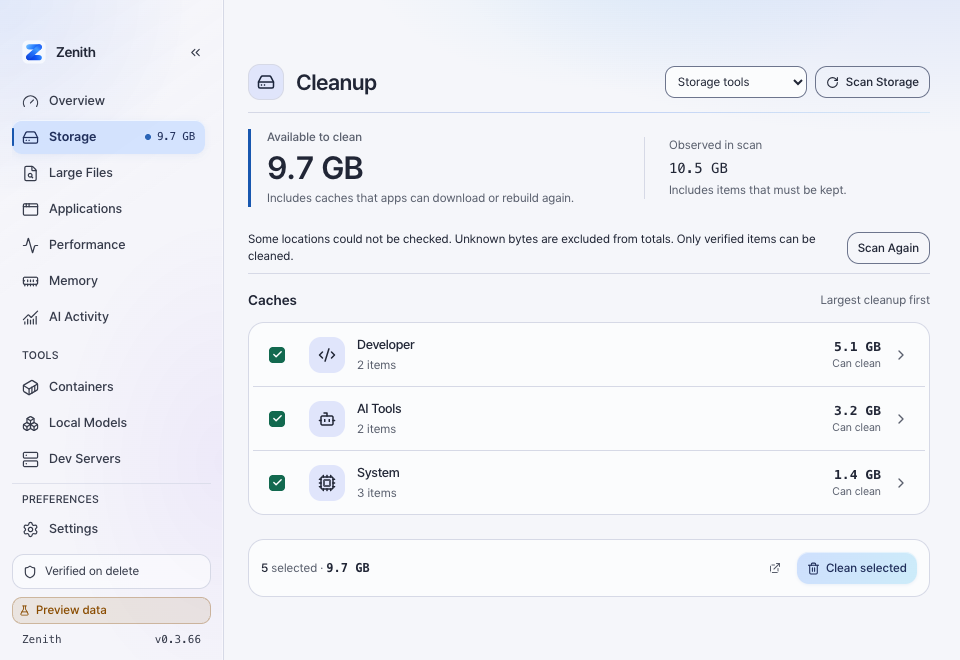
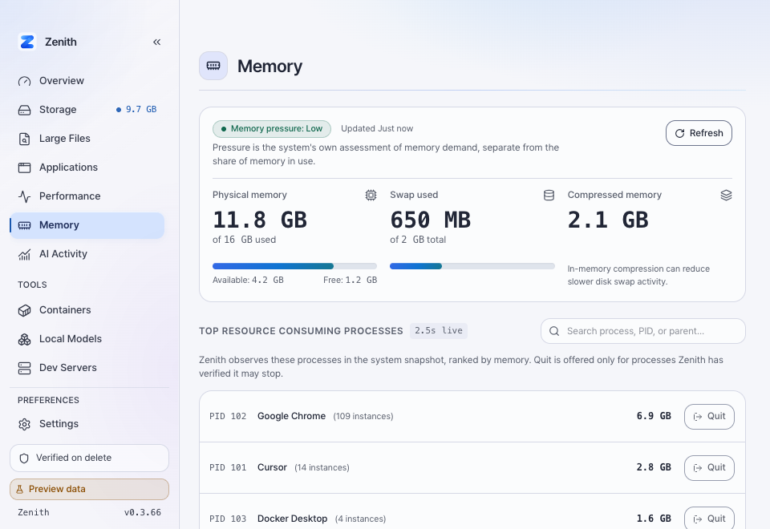
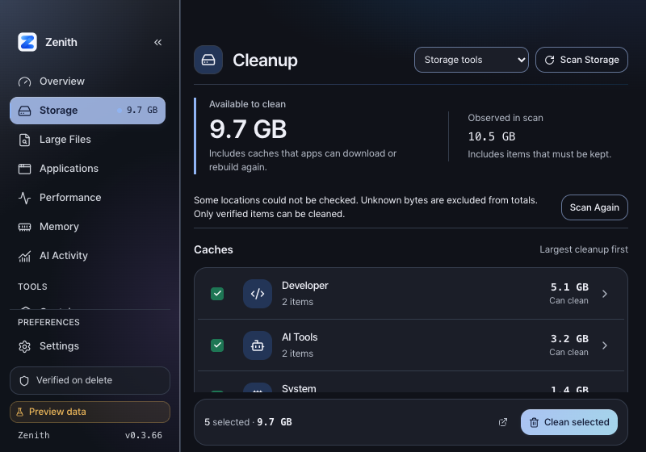

<!-- Hallmark pre-emit critique: P4 H4 E4 S5 R4 V3. Existing application contract preserved. -->
# Cleanup Coverage and Direct Navigation, 0.3.66

Issues: #316, #320, #321. One review and CI batch; version 0.3.65 -> 0.3.66.

## Measured Coverage

Read-only native scans on macOS 27.0 (26A428), 2026-09-27, compared the same two
DotSlash artifact paths. Paths and hash identifiers are deliberately omitted.
The baseline ran at 02:10:08 UTC; the working-tree scan at 02:48:40 UTC.
Both reports identify 0.3.65 because measurement preceded this PR's version bump.

| Unit | Observed bytes, both scans | Before cleanable / selected | After cleanable / selected |
| --- | ---: | ---: | ---: |
| A | 270,749,696 | 0 / 0 | 270,749,696 / 270,749,696 |
| B | 266,481,664 | 0 / 0 | 266,481,664 / 266,481,664 |
| Total | 537,231,360 | 0 / 0 | 537,231,360 / 537,231,360 |

The gain is 537.2 MB decimal (512.34 MiB) of eligible cleanup, not measured free
disk space. No real cache was deleted, no live lock metadata was created, and
no Trash was emptied. Filesystem mutation tests use temporary fixtures only.
Other live caches changed between scans; their total changes are not attributed
to this patch. This closes one measured cause of the Mole gap, not overall
parity. Chromium component downloads (#317) and CacheStorage (#318) remain open.

## Owner Contract

Pinned upstream: facebook/dotslash commit
`1f94ba967f2cdfb4de1fb191735b002702c58d6c`.

- [Cache layout](https://github.com/facebook/dotslash/blob/1f94ba967f2cdfb4de1fb191735b002702c58d6c/src/dotslash_cache.rs): lock metadata is independent of artifact presence. Missing metadata alone cannot establish corruption.
- [Owner lock](https://github.com/facebook/dotslash/blob/1f94ba967f2cdfb4de1fb191735b002702c58d6c/src/util/file_lock.rs): create the lock if absent, without truncation, and acquire its exclusive advisory lock.
- [Download protocol](https://github.com/facebook/dotslash/blob/1f94ba967f2cdfb4de1fb191735b002702c58d6c/src/download.rs): the owner creates parents for the matching artifact lock. Upstream locking is best effort, so it is not a universal execution barrier.
- [Execution path](https://github.com/facebook/dotslash/blob/1f94ba967f2cdfb4de1fb191735b002702c58d6c/src/execution.rs): existing-artifact execution does not always acquire the download lock. Neati retains its running-owner and executable checks.

Neati's read-only scan now accepts absent metadata. Execution creates or opens
the exact owner lock using held directory descriptors, `mkdirat` / `openat`,
no-follow flags, identity checks, and a nonblocking exclusive lock. Lock files
are neither truncated nor unlinked on release. Unsafe metadata, held locks,
hardlinked files, replaced identities, incomplete measurement, and running
owners still fail closed.

The lock fix exposed a second refusal: each measured artifact contained 14 normal
framework archive links. Whole-artifact Trash now preserves forward-relative
link nodes without traversing them. Absolute and parent-traversing targets,
linked artifact roots, hardlinked payload files, and special nodes remain
refused. This is only the typed DotSlash adapter; generic recursive cleanup
does not gain permission to follow or delete linked targets.

## Navigation

- Existing destinations and the visible Tools group remain. No disclosure hides menus.
- Memory, Large Files, and Applications each open directly from the sidebar.
- Memory has its own focused page without another tab strip.
- Cleanup opens first when enabled and available; saved visibility/order and exact native deep links remain respected.
- Storage's five equal tabs become one compact native workflow selector. Return actions synchronize the shell route and restore selector focus.
- Existing cleanup authorization, byte accounting, stateful confirmation, native glass, and shared design tokens are unchanged.

## Verification

Local checks on 2026-09-27, macOS 27.0 (26A428), application 0.3.66:

| Check | Result |
| --- | --- |
| `cargo test --workspace` | 1,133 passed; 4 existing ignored export/manual tests |
| `cargo check --workspace` | Passed |
| `just lint-rust` | Format and all-target Clippy, warnings denied: passed |
| `just check-architecture` | Both crate boundaries passed |
| `pnpm check` | 0 errors, 0 warnings |
| `pnpm test -- --run` | 407 tests, 42 files passed |
| `pnpm build` | Production build and Tailwind verification passed |
| `just check-version` | All six version outputs synchronized at 0.3.66 |
| `just build-fast` | Embedded frontend debug `.app` bundle built |
| Bundle inspection | Both plist versions 0.3.66; packaged `icon.icns` hash matches source |

Browser QA used deterministic preview data with agent-browser/Chromium:
800x560, 960x660, and 1440x900; expanded/collapsed sidebar; light/dark CSS states;
reduced motion; direct destinations; unique active navigation; selector and
return focus; sticky cleanup action reachable and visible at 800x560; no
horizontal document overflow at these desktop sizes. Dark CSS was explicitly
emulated in the DOM; preference persistence was not validated in preview.
The preview correctly refused cleanup mutation. Actual cleanup behavior is
covered by fixture tests, not by a live destructive UI run.

These are browser layout screenshots, not evidence of native glass rendering.
Windows runtime/installer and macOS native material interaction are not manually
verified here. CI is reported separately on the PR. The built bundle was not
installed over or launched instead of the user's running app; no release or tag
was published.

## Screenshots

Cleanup, 960x660, light:

Direct Memory page, 960x660:

Cleanup, 800x560, dark CSS state:

Design review: preserved app-specific tokens and typography, no new decorative
assets or hero composition, no new animation library, no hidden Tools group.
Responsive checks cover supported desktop sizes, not a mobile product claim.
