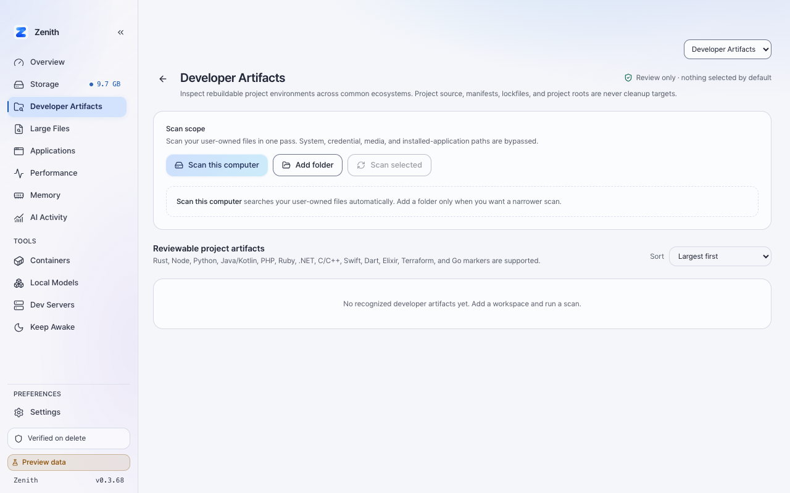

# Developer Artifacts navigation evidence (0.3.68)

- Date: 2026-09-27
- Revision: `feature/324-restore-developer-artifacts-navigation`
- Surface: browser preview at 1280 x 800
- Mock data: enabled

## Result

`Developer Artifacts` appears directly beneath Storage alongside the other
frequent cleanup workflows. Selecting it opens the existing reviewable project
artifact scanner in one click, synchronizes the Storage workflow selector, and
marks only the child destination as current.

## Limitations

This capture verifies frontend navigation, layout, selected state, and the
browser-preview contract. It does not exercise native folder selection,
filesystem scanning, or recoverable Trash execution. Those backend workflows
are unchanged by this navigation-only fix. The installed application was not
replaced.
