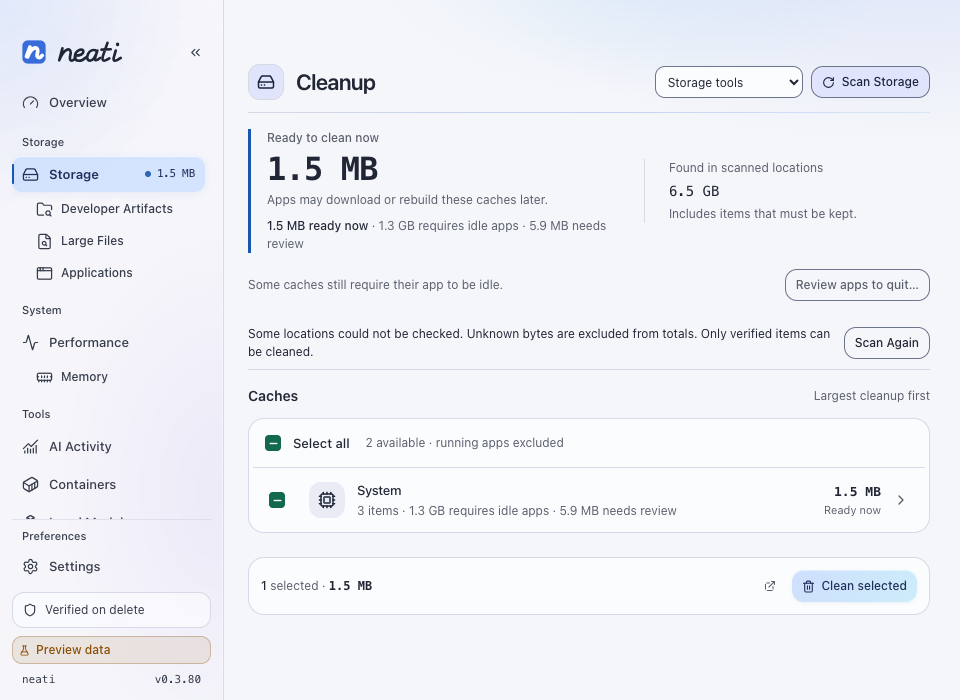
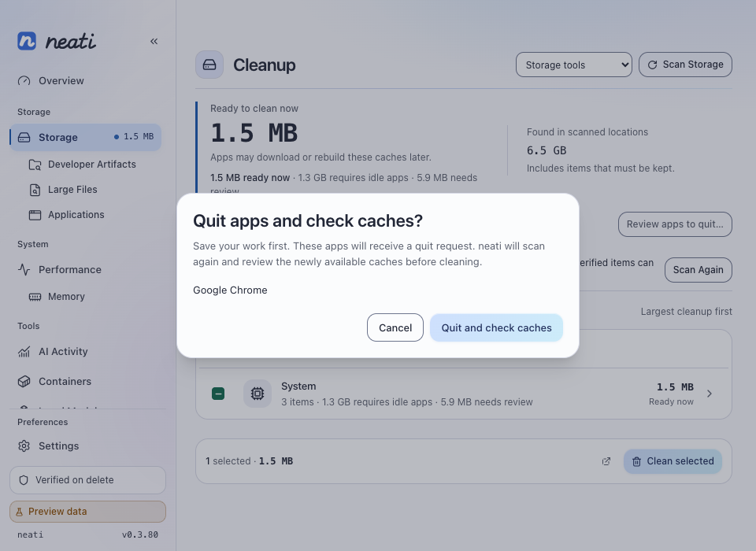

# Actionable cleanup validation — 0.3.80

Date: 2026-09-29. Host: Apple Silicon, macOS 27.0 (26A428).
Base: `c1a1281` / 0.3.79. This change targets 0.3.80.

## Scope

1. macOS Chromium offline units use exact open-handle evidence while the browser
   can remain running. Component update stores retain their owner guard; Windows
   keeps its browser-exit requirement.
2. Cleanup headline and category metrics show ready-now bytes. Running-owner and
   review-required amounts remain visible separately.
3. Ordinary pruned user-cache/log payloads use exact handle checks instead of
   blanket namespace-owner presence. Explicit executable guards, other inferred
   store owners, structured-state exclusions and compiled-model protection remain.
4. Real Conda/mise validation identified and fixed mise's omitted default task
   settings and verification recreating its own update cache.
5. Reviewed app shutdown reuses verified, one-shot memory termination leases,
   requests graceful termination, rescans, and presents a new cleanup review.
   Cancellation stops the next step. Protected processes and unmapped owners
   remain unavailable; browser variant channels require manual exit. A busy offline
   unit does not authorize browser shutdown because another process may hold it.

## Automated checks

- `cargo check`: passed.
- `cargo test`: 1,211 passed, 5 pre-existing ignored export tests.
- `pnpm check`: no errors or warnings.
- `pnpm test -- --run`: 441 passed.
- `pnpm build`: passed, including Tailwind asset checks.
- `just lint-rust`: format and Clippy with warnings denied passed.
- `just check-architecture`: core/platform dependency boundaries passed.
- `just check-version`: synchronized 0.3.80.
- `just build-fast`: `.app` bundle built with the current frontend; both bundle
  version fields are 0.3.80. Packaged executable matches the debug build and the
  packaged icon matches the source asset. The installed/running app was not replaced.

Tests cover live-browser/idle-unit eligibility, in-use and unknown handle refusal,
handles opening at the final mutation check, component-store protection, Windows
fallback policy, scan/planning/execution guard agreement, changed process identity
and protected-app refusal through the existing termination executor, cancellation,
interrupted rescans, preview-mode refusal, and the reported 1.5MB/1.3GB display case.

## Real owner-command validation

Tools were downloaded from their official releases into a disposable home under
`/private/tmp/neati-cli-validation-*`. SHA-256 matched the release checksums.
The production adapters performed scan → prepare → execute → post-check. The
process port was an idle fixture for these isolated installations. No user cache,
running application or global tool installation was changed.

| Tool | Version | Observed and removed allocated bytes | Post-check |
| --- | --- | ---: | --- |
| [Conda / Miniforge](https://github.com/conda-forge/miniforge/releases/tag/26.7.2-0) | Conda 26.7.2 | 69,316,608 (113 candidates) | 0 candidate bytes |
| [mise](https://github.com/jdx/mise/releases/tag/v2026.9.16) | 2026.9.16 | 28,672 (3 roots) | 0 candidate bytes |

Conda/Python executables, mise's executable, installed-tool marker, configuration,
and trust records were asserted present afterward. mise's cache, environment-cache
and task-state payload markers were asserted absent. The validation executable is
`src-tauri/examples/validate_tool_cleanup.rs`; it only accepts a disposable-root
path with the stated prefix. It expects both tools and the fixture markers from
this procedure, and deliberately fails on an empty fixture.

Download checksums:

- Miniforge3-26.7.2-0-MacOSX-arm64.sh:
  `d70bfa2e97afcda96927c9b9ca0e2316cb7750e4ce651c94388267cbe9588711`
- mise-v2026.9.16-macos-arm64:
  `86cda8dde0fa9181706e825323dd8e26e96721a1b3cf37cbc610dd1680fecfda`

The mise command environment disables its update warning/check, automatic update
and opportunistic cache pruning. The verified upstream behaviors are in
[doctor](https://github.com/jdx/mise/blob/v2026.9.16/src/cli/doctor/mod.rs),
[cache clear](https://github.com/jdx/mise/blob/v2026.9.16/src/cli/cache/clear.rs),
and [settings](https://github.com/jdx/mise/blob/v2026.9.16/settings.toml).

## UI evidence

Browser preview, 960 × 700, light theme. The data deliberately reproduces the
reported split: 1.5MB ready, 1.3GB requiring an idle owner, 5.9MB requiring review.
These are illustrative fixtures, not a new measurement of the user's disk.
The quit dialog was opened and cancelled, and its confirm action was verified to
refuse preview mode rather than report a process termination that never happened.

## Platform limits

No real user application was terminated. Native process identity/termination
behavior is covered by temporary/fake process tests, not a manual Chrome shutdown.
No real browser cache was removed in this validation. Browser UI previews do not
verify native glass. Windows runtime/packaging results belong to CI and must be
reported separately. Moving browser units to Trash does not itself free disk space.
