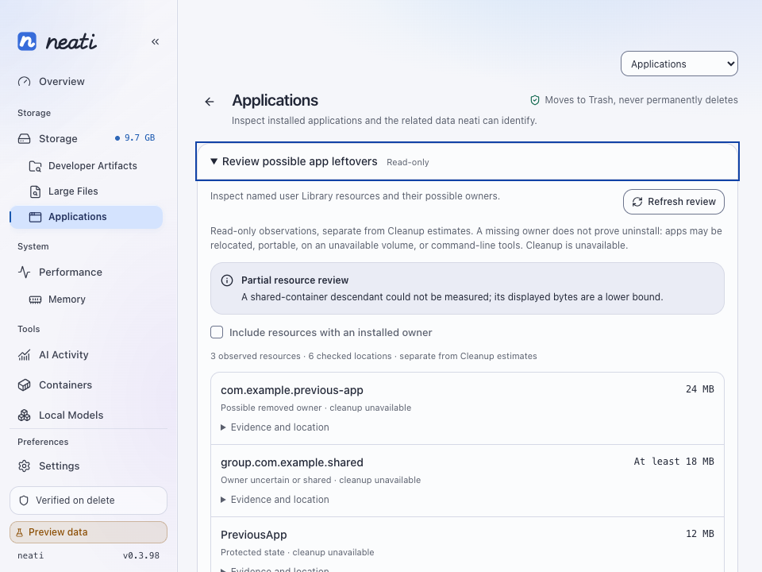
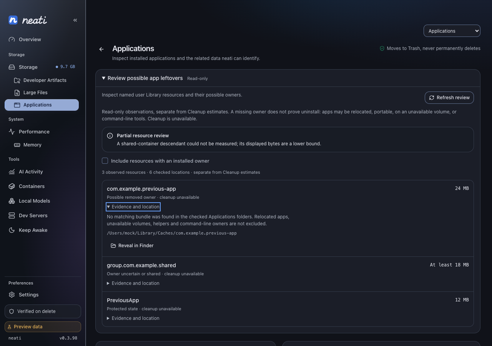

# macOS coverage and read-only Applications review

Recorded October 1, 2026, neati 0.3.98, macOS 27.0.1 (26A434).

## Local verification

- Workspace/all-target Rust tests: 1,366 passed, 7 existing ignored, zero failed.
  Check, format, Clippy with warnings denied, architecture and binding drift passed.
- Frontend typecheck: zero errors/warnings; 491 tests passed. Production build,
  61-icon drift check and synchronized-version check passed.
- The actual installed gh 2.83.1 completed the production owner workflow in a
  disposable home: 8,192 allocated bytes removed and five outside-scope sentinels
  preserved. Injected idle-use ports were fixtures. Final ancestor and equal-size
  payload replacements were blocked before command launch.
- `just build-fast` produced 0.3.98 with the source icon and current frontend
  asset names embedded. The installed/running application was not replaced.

## Browser evidence

Applications was checked at 800 × 560, 960 × 720 and 1280 × 900 with reduced
motion. The initially closed read-only disclosure, installed-owner filter,
partial/lower-bound labels, keyboard focus, evidence, refresh and Reveal controls
were exercised. Resource rows grant no selection or cleanup authority.

These are Chromium previews with mocked IPC. Native Finder, glass, TCC and
Windows behavior are unverified by these images. Actual Arc installation/version
root validation remains in #382; native permission transitions remain in #362.
The current-machine observation removed zero user bytes and measured no
free-space delta. CI results are reported separately on the PR.
