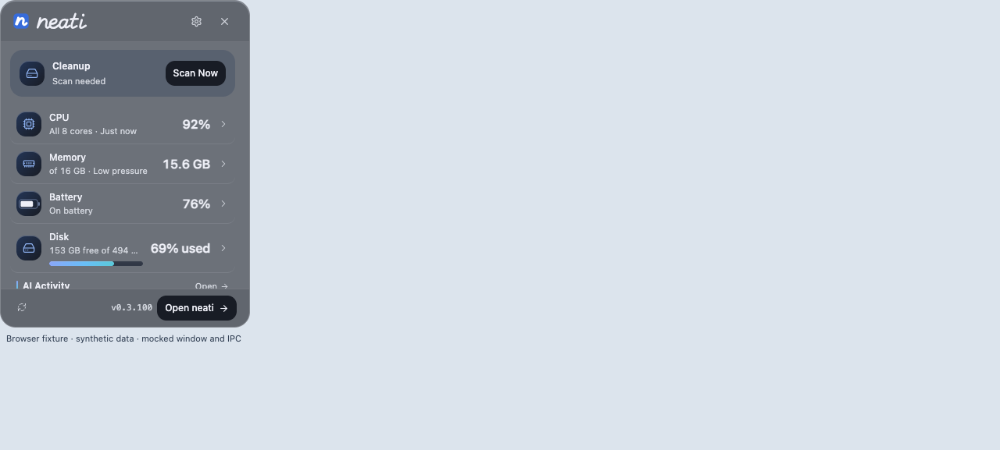
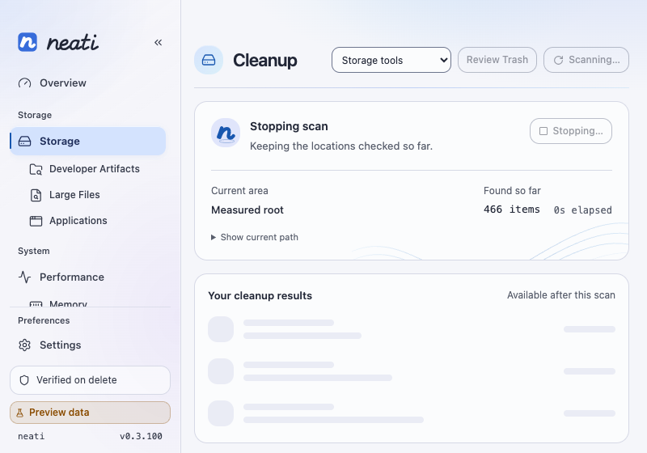
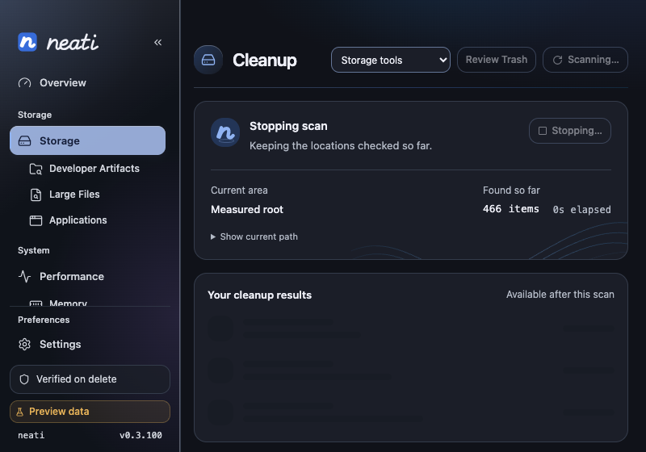
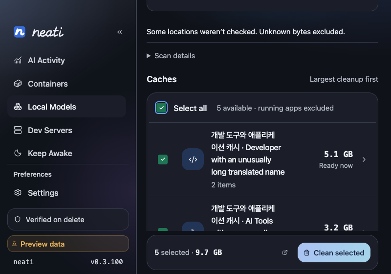

# Browser lifecycle and accessibility evidence

2026-10-01, reserved neati **0.3.100**, based on `develop@63a8a3e`;
MacBook Air M1 / 16 GiB, macOS 27.0.1 (26A434), headless Chromium.
These are mounted production components with synthetic API/window ports.
They do **not** establish native glass, tray alignment, actual window bounds,
installed-app TCC, VoiceOver output or Windows desktop behavior (#376/#389).
No installed app, permissions or user data were changed.

- Reproduced the prior memory subscription leak: remove the memory section
  while visible, then hide; one consumer remained. The new activation-owned
  releases leave zero consumers for removed sections and hidden panels.
- All **156 checks** passed across 320/360/400 px and light/dark: streamed
  loading, partial, fresh, stale, empty, disconnected, timeout, error and long
  provider states retained bounds/footer; unknown states rendered no quota meter.
- Removed metric/AI sections, hide/reopen, a delayed obsolete monitor result,
  Escape and a 320×420 work area passed. Header/footer remained reachable;
  the body scrolled. Reduced motion had no running document animations.
- **26 view/theme cases** at 800×560 and 125% text with long English/Korean
  labels had no document horizontal overflow or unnamed visible buttons.
  **55 sequential Tab stops** remained visible; custom checkboxes showed their
  focus ring on the visible label proxy. This is not a complete accessibility audit.
- **Six mounted progress/Stop runs** delivered 1,558 API events / 466 items.
  Callback bursts took 0.5–2.1 ms, the subsequent frame 0.7–5.9 ms; click-to-mock
  cancellation dispatch took 0.2 ms and status mutation 1.2–2.1 ms. Pointer and
  Enter both cancelled the scan. No progress-count announcement occurred;
  the status changed once to “Stopping scan”. Pending progress authorized no
  cleanup and the accepted empty cancelled result selected zero bytes.
  These are observed timings, not thresholds or native IPC/OS response times.

Reproduce with `scripts/build_quick_panel_validation.mjs` and
`scripts/build_ui_polish_validation.mjs`. Their public fixture drivers expose
transitions, subscriptions and real scan-store progress/Stop through mock API ports.

